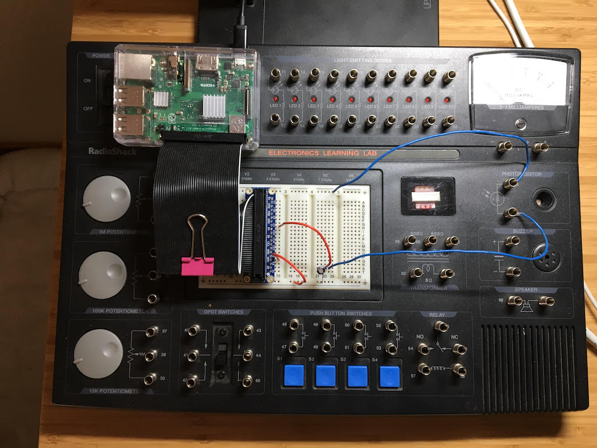

# Raspberry Pi Headless Setup

My process for setting up a Rasberry Pi 3B+ without an attached keyboard, monitor or GUI. Uses Raspbian Buster Lite.

* Command line script for **bootstrapping** a working system
    - burning an OS image
    - setting up WiFi
    - setting up key-based SSH authentication
* Ansible Playbooks for **provisioning** software
  - PostgreSQL
  - TimescaleDB
  - Python
  - Example application (photoresistor)


For a description of the circuit see
[my previous blog post](https://www.perrygeo.com/raspberry-pi-real-time-sensor-plots-w)



## Bootstrapping

Fetch the latest image

```bash
wget -O rasbian_lite_latest.zip https://downloads.raspberrypi.org/raspbian_lite_latest && \
  unzip rasbian_lite_latest.zip && \
  rm rasbian_lite_latest.zip
```

You should have a file named something like `2019-07-10-raspbian-buster-lite.img`

Insert the SD card
```bash
diskutil list
```

Find the disk name for the SD Card, in my case `disk2`

```bash
diskutil unmountDisk /dev/disk2
LATEST=2019-07-10-raspbian-buster-lite.img
sudo dd bs=1m if=$LATEST of=/dev/rdisk2 conv=sync
```

Wait for it to mount then

```bash
cd /Volumes/boot/

# Enable ssh
touch ssh

# Install the wifi credentials
cat << EOF > wpa_supplicant.conf
ctrl_interface=DIR=/var/run/wpa_supplicant GROUP=netdev
update_config=1
country=US

network={
    ssid="ssid"
    psk="password"
    key_mgmt=WPA-PSK
}
EOF
```

Unmount the disk, insert the SD Card into the Pi and turn it on.

After a minute or two, you should be able to log into your wifi router's
administration interface and find the DHCP-assigned IP address for your Pi.


```bash
ssh pi@192.168.1.144
passwd  # default pass is "raspberry", enter a new pass twice
exit
```

Then copy your ssh creds and confirm that key-based auth works (ie no password prompt)

```bash
ssh-copy-id pi@192.168.1.144
ssh pi@192.168.1.144
exit
```

That should be the last time you need to manually ssh into the Pi.

## Provisioning

Get ansible, use a virtualenv

```
pip install -U ansible
```

Make a `hosts` file, editing the IP address accordingly

```
[pi]
192.168.1.144 ansible_user=pi
```

Run the playbook

```
ansible-playbook -i hosts pi.yml
```
