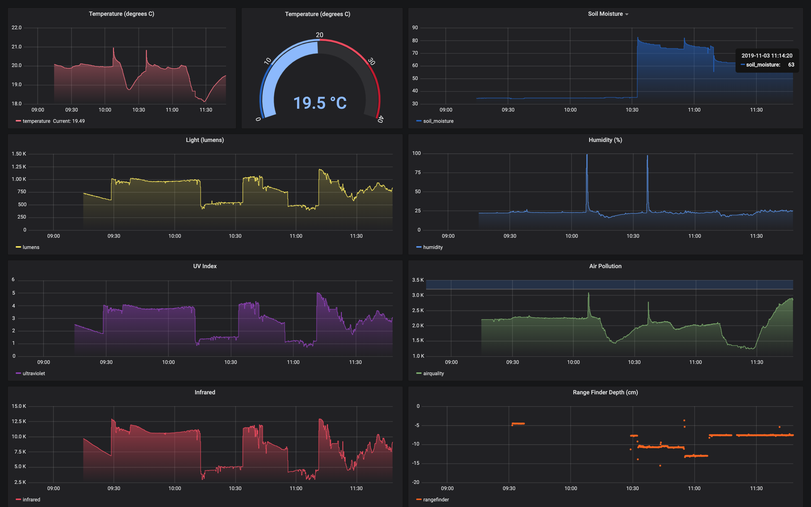

# SmartGarden v1



## Install

* `make` to run ansible script
* Manually install timescaledb according to offical docs, apt install cmake libssl-dev
* Install grafana on pi

```
wget https://dl.grafana.com/oss/release/grafana_6.4.3_armhf.deb
sudo dpkg -i grafana_6.4.3_armhf.deb
sudo apt --fix-broken install
sudo /bin/systemctl daemon-reload
sudo /bin/systemctl enable grafana-server
sudo /bin/systemctl start grafana-server
```

* create pi user in postgresql, pi database
* `create_table.sql`
* Install and run `sensor.py` 

```
rsync sensors.py pi@smartgarden1:/home/pi/SDL_Pi_SmartGardenSystem/sensors.py &&  \
  ssh pi@smartgarden1

cd SDL_Pi_SmartGardenSystem && python sensors.py
```

## Dashboard

http://smartgarden1:3000/d/v8U2lXgRz/smart-garden-v1-0?orgId=1&refresh=5s

## TODO

* ansiblize entire install and setup
* put dashboard on internet and secure it.
* python code cleanup, py3, use recent circuitpython code
* drop chunks
* monitor cpu, cpu temp, mem, disk space in separate grafana db
* put postgres database on USB3 drive
* outputs, an application to query db and take action
  - turn on lights, water pump, fan, heater
  - update lcd display, e-ink display?
* waterproofing?